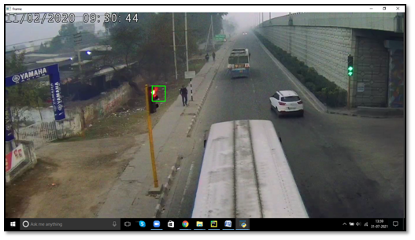

# Red Light Traffic Detection


## Expected outcome




## Instructions to run the code

* Download the source and input video containing footage of traffic

* Update the path of the file in line number 7 of the given code

* Run the code


### Dependency

Can be installed using command
```python
pip install opencv-python
```
